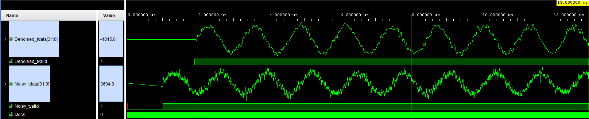

# FPGA Wavelet Processing: DWT and IDWT using Daubechies-4 Wavelets

## Overview

Welcome to an FPGA implementation of wavelet processing! :wave:

This repository contains a complete RTL implementation of a one-dimensional
Discrete Wavelet Transform (DWT) and Inverse Discrete Wavelet Transform (IDWT)
architecture for FPGA platforms.

The project implements hardware accelerators based on the Daubechies-4 (Db4)
wavelet, providing reusable building blocks for real-time signal processing
applications such as:

- signal denoising
- data compression
- multiresolution signal analysis
- feature extraction

The complete design is written in Verilog RTL and developed using Xilinx Vivado.

The main goal of this repository is to provide a collection of reusable FPGA
wavelet processing blocks that can be integrated into custom DSP and embedded
systems.

This is not intended to be a final application-specific IP core. Instead, the
idea is to provide a flexible starting point for anyone interested in exploring
wavelet algorithms on FPGA hardware.

---

# Why this project? :bulb:

Wavelet transforms are powerful tools for analysing signals at different
resolutions. They are widely used in digital signal processing, especially for
applications where both time and frequency information are important.

Software implementations of wavelet transforms are widely available, but
finding complete and reusable FPGA RTL implementations is much more challenging.

This repository aims to provide a practical hardware starting point for:

- researchers working on FPGA-based signal processing
- students exploring hardware DSP
- engineers developing custom wavelet accelerators

The main objectives are:

- provide synthesizable RTL wavelet processing blocks
- implement complete DWT and IDWT pipelines
- provide reusable Mallat decomposition trees

---

# Implemented Hardware Blocks :gear:

## Db4 Wavelet Decomposition Block

The Db4 decomposition block implements the analysis stage of the Discrete
Wavelet Transform.

The block performs:

- low-pass filtering H(z)
- high-pass filtering G(z)
- downsampling %2

The architecture is based on fixed-point arithmetic optimized for FPGA
implementation.

---

## Db4 Wavelet Reconstruction Block

The reconstruction block implements the synthesis stage required by the Inverse
Discrete Wavelet Transform.

The block performs:

- coefficient upsampling
- synthesis filtering
- signal reconstruction

When wavelet coefficients are not modified, the architecture provides perfect
reconstruction of the original signal.

---

## Hard Threshold Block

The repository includes a fixed hard-thresholding block for wavelet denoising
and compression.

This simple operation removes small wavelet coefficients, which are often
associated with noise components.

By controlling the threshold value, the same hardware block can be used for both
denoising and compression applications.

---

# Block Designs :wrench:

The repository includes three Vivado block designs showing different use cases
of the implemented wavelet cores.

---

## Db4_loop

The `Db4_loop` block design demonstrates a complete FPGA wavelet processing
pipeline using DMA data transfer.

Input samples are transferred to the FPGA through an AXI DMA interface as
16-bit samples.

The processing chain includes:

1. Db4 wavelet decomposition using the Mallat algorithm
2. Hard thresholding of detail coefficients
3. Db4 inverse wavelet reconstruction
4. DMA transfer of processed data back to the host

The output data are packed into 32-bit words containing the processed wavelet
coefficients.

This block design shows how wavelet-based compression can be implemented in
hardware for real-time FPGA applications.

---

## Simulation

The `simulation` block design provides a simple environment to test wavelet
denoising.

A sinusoidal waveform is generated using a 32-bit DDS module and corrupted with
high-frequency noise.

The noisy signal is then processed through:

- Db4 decomposition
- hard threshold filtering
- Db4 reconstruction

The simulation allows an easy comparison between:

- noisy input signal
- reconstructed denoised signal

It can be used as a starting point to test different threshold values and study
the effect of wavelet filtering.

  

---

## all_levels_blocks

The `all_levels_blocks` design contains reusable multilevel wavelet processing
architectures based on Mallat decomposition trees.

Three different configurations are implemented:

- 1-level wavelet processing
- 2-level wavelet processing
- 3-level wavelet processing

Each configuration performs:

- Db4 decomposition
- detail coefficient thresholding
- Db4 reconstruction

These architectures are designed for streaming applications.

FIFO memories are included inside the Mallat trees to compensate for the
different delays introduced by the wavelet branches.

---

# Build Instructions :hammer_and_wrench:

The project can be generated automatically using the provided Vivado TCL script.

After cloning the repository, run:
 "vivado -mode batch -source build_project.tcl"

The script automatically:

- creates the Vivado project
- imports all RTL sources from `src/hdl`
- loads block designs from `src/bd`
- configures the project for synthesis and implementation

After project generation, the standard FPGA flow can be executed:

- synthesis
- implementation
- bitstream generation

---

# References :books:

The theoretical background of this project is based on:

S. Mallat,

"A Theory for Multiresolution Signal Decomposition: The Wavelet Representation",

IEEE Transactions on Pattern Analysis and Machine Intelligence,

1989.

I. Daubechies,

"Ten Lectures on Wavelets",

SIAM,

1992.

---
